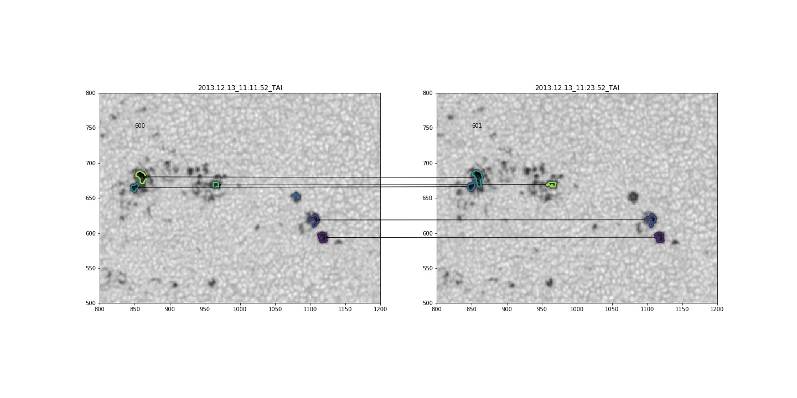
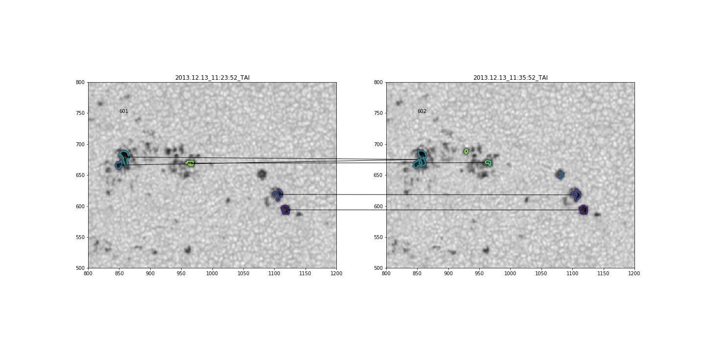

## Tue 16 Jul 2019 12:32:42 AM CEST
Decided to go with HMI HARPs because they are extracted patches of active region; They are standard HMI vectorgram but they extracted patches where they found AR;
There is kind of 1:1 NOAA AR to HARPNUM mapping, but some AR can be in multiple NOAA AR; Got full list of AR -> HARPNUM;

TO DO: Find all HARPNUMP for all AR that Jan sent you so you can make JSOC query. (Think about python vs ssw for data retrival; Python has nice and clean API)

## Sat 20 Jul 2019 05:06:54 PM CEST

Created a query to map NOAA AR to HARPS list:
```
cat AR_LIST | grep -Ev "^#" | awk '{ print $1 }' | xargs -I '{}' grep '{}' HARPNUM_NOAA.txt  | awk '{ printf "%.4d\n", $1 }'
```

It will take first column from AR_LIST sent by Jan, and map it to HARPNUM_NOAA.txt file retrived from JSOC.
Note that some HARPS will have multiple NOAA AR regions in it, in our case that is one `(HARPS:284  NOAA:11133,11134)`

## Tue 23 Jul 2019 11:38:21 AM CEST

If you want to create query on HMI sharp/harp but you only know NOAA AR number and start date, you can write down query like this 

```hmi.sharp_720s_nrt[][2013.12.07/21d][? NOAA_ARS ~ "11923" ?]{**ALL**}```

- `[]` is HARPNUM; Empty because we dont know it
- `[2013.12.07/21d]` - Start date and duration
- `[? NOAA_ARS ~ "11923" ?]` - Query string to filter specific AR
- `{**ALL**}` - i think this is record limit, but im not sure.


Also, manual is here http://jsoc2.stanford.edu/ajax/RecordSetHelp.html (example 6)


## Tue 23 Jul 2019 12:17:36 PM CEST

Problem with query above is that we are using nrt (near real time data) its fast track pipeline for live checking of data (i assume), if we change to regular 720 sharp, query is working with HARPS number as expected.

You can see different sharps formats here http://jsoc.stanford.edu/doc/data/hmi/sharp/sharp.htm, i've opet out for trying hmi.sharp_720s (and later on hmi.sharps_cea_720s) and abandon nrt.

So SHARP query at the end should be like ```hmi.sharp_720s[3604]{**ALL**}```

Also, this fixes missing NOAA -> HARPNUM problem and removes query by date and NOAA_ARS number; Its cool

## Tue 23 Jul 2019 04:04:14 PM CEST

Downloaded SHARP data for HARPNUM 3481 and 3604 (corresponding to NOAA AR 11923 and 11950); We downloaded both SHARP 720s and SHARP CEA 720s; Currently on `chromosphere:/seismo4/lzivadinovic`

| HARP |  NOAA  | JSOC_ID           | CEA_JSOC_ID      |
| -----|--------|-------------------|------------------|
| 3604 |  11950 | JSOC_20190723_431 | JSOC_20190723_505| 
| 3481 |  11923 | JSOC_20190723_429 | JSOC_20190723_489|

CEA - are reprojected to local frame, ambiguity resolved magnetic data (Br, Bp, Bt) see sharp webpage for more details; They are also rotated for 180 degrees so that north is up, and east is right. TAKE CARE WHEN COMPARING TO REGULAR SHARP DATA!

This data is bassicaly prepared for analysis.

## Tue 23 Jul 2019 11:30:05 PM CEST

Tried this out https://github.com/cdiazbas/enhance looks fun and works well. Tested on sunspots with lightbridges, looks really good on enhanced images. Note that you get better results if you normalize data by quiet sun. In the end, i dont see any use of it because we are not interested in small scale structures evolution.

## Wed 24 Jul 2019 11:27:45 AM CEST

Created ipynotebook for creating mp4 files that represents data animation/evolution. 

Add requirements.txt (its mess, but at least its working with enhance)

#### Note on requirements provided 

Please use virtualenv if you dont want to mess your system!

You need to install specif version of packages, simple `pip install -r requirements.txt` will not work because there are packages that were compiled/installed via git

IIRC, these are onyl two i used (keras and tf contrib)

```bash
sudo apt install imagemagic imagemagick-common ghostscrip libtk-img libtk8.6 libcfitsio
pip install sunpy[all] #in zshell use pip install sunpy\[all\]
pip install astropy[all] # -||-

pip install git+https://www.github.com/keras-team/keras-contrib.git

#also you need to clone repo and run this https://github.com/keras-team/keras-contrib#install-keras_contrib-for-tensorflowkeras
#its some wraper thing i dont quite understand
```

I recommend going `pip install -r requirements.txt` untill you encounter error for some package, remove that package from txt file, and rinse and repeat with pip install unitl you get over all packages. Then run install `sunpy[all]` and `astropy[all]` and keras contrib with both pip and cloned repo (this conversion stuff) and that should be it


## Wed 24 Jul 2019 02:07:32 PM CEST

Tried PCA reduction for removing limb darkening, it only works with data that are near limb. (comment bellow pasted from animate.ipynb, see animate.html for prerendered notebook with data and comments)

Idea is that because there is no obvious intensity gradient, primary component of SVD is not actually limb darkening but some small scale variation across image. This leads to adding some artifacts that are not related to limb darkening, so this method is not suitable for removing limb darkening near disk center. Better idea is to create limb darkening function for this specific filter using some curve $f(r,\lambda)$, where $r$ is distance from disk center, and find $r$ for every pixel and reduce it that way.


## Wed 24 Jul 2019 04:35:32 PM CEST

Quick memo: DONT FORGET TO FIX HEADER ON IMAGES ONCE YOU RUN ENHANCE! When running enhance, your images are upscaled by factor of 2, so crval1/2 and crpix1/2 changes acordingly

## Wed 24 Jul 2019 05:55:17 PM CEST

Created function for limb darkening using http://articles.adsabs.harvard.edu/pdf/1977SoPh...51...25P (see limb_darkening.html/ipynb) for more details;

I cant figure out coordinate system mapping of SHARP CEA. Im having problem calculating distance from sun center in r_sun using CRVAL, near limb and center images have very similar values for this keyword. Not sure what is happening, but i found out that someone wrote conversion http://hmi.stanford.edu/hminuggets/?p=1428 (look at [S1] reference). I thought that it should be crpix = center pixel coordinate in pixels, crval = centar pixel coordinate in some coordinate system (Carrington in this case, but comparing near limb and center images shows different results). Need to read conversion to figure out what is happening. Also, http://jsoc.stanford.edu/doc/keywords/JSOC_Keywords_for_metadata.pdf crunit2 (y axis) for CEA should be sin latitude (or something like that) but in our data is degrees. IDK.


## Thu 25 Jul 2019 06:34:18 PM CEST

Finally figured how to easily and quicky transform images to helioprojective coordinates (distance from disk center in arcsecond) so we can now easily correct for limb darkening.

There are some concerns regarding general coordinate transformation for HMI data. Some people say that SDO does not report (in header) same satelite possiotion for HMI and AIA data taken at the same time, and also there is still discussion on how carrington system is deffined (if i understood correctly some guy in chatroom) (see https://github.com/sunpy/sunpy/issues/3057) 

Albert Y. Shih:
"Re HMI, do keep in mind that we don't have a good observer coordinate from the FITS headers (see  issue #3057), so conversions between HPC and HGC in SunPy may not match whatever is done elsewhere (and that's on top of the fact that people don't necessarily agree on the definition of Carrington longitude"

Big thanks to Stuart Mumford, lead developer of sunpy for helping me figure this out (https://github.com/Cadair).

General comments regarding code detalis and procedures were added to limb_darkening notebook. (for non interactive preview open limb_darkening.html)


## Thu 25 Jul 2019 06:43:29 PM CEST

Reading material (helpers):

https://arxiv.org/pdf/1309.2392.pdf

https://nbviewer.jupyter.org/github/mbobra/calculating-spaceweather-keywords/blob/master/feature_extraction.ipynb

http://jsoc.stanford.edu/relevant_papers/ThompsonWT_coordSys.pdf


## Fri 26 Jul 2019 02:59:25 PM CEST

Wrote wraper function that will do limb darkening clearing of images. Its bassicaly nicely written wrapper for stuff we did yesterday. Note that we did not change header of original images (for example mean intensity keyword is incorect, etc...) everything else should be fine.

I did not wrote comments in script, because limb_darkening.ipynb/html contains detailed instruction for one image reduction; Also, to convert ipynb to actuall python script that you can actually run with `python script.py` one can use `jupyter nbconvert --to script remove_limb_darkening_for_dataset.ipynb` it will create file with same name but with .py extension and removing all json embedded data.

## Fri 26 Jul 2019 09:32:17 PM CEST

Tried https://docs.sunpy.org/en/stable/api/sunpy.map.GenericMap.html#sunpy.map.GenericMap.resample and its working as expected. It's even updating headers, so that coordinate frame stays fixed and you can use it later on. It does not update naxis1/2 (dimension of image), but that is no big deal, coordinate delta per pixel, and reference center pixel is updated. Would recommend further usage of this procedure! (maybe submit PR to fix this issue?)

There is also small artifact, that shows up as 0 value padding on the outtermost pixels. So your whole image (rescaled to finner grid using cubic interpolation) is sorounded by 1px box with value 0, but we can just ignore those, normalized histograms looks identical.

Also, i've changed enhance codebase to allow writing back fits headers from enhanced images. I will need to transform header to perserve resampled data coordinate grid, my plan is to use code from sunpy.map.resample as base because they have it very clearly written how they transform header to perserve coordinate grid. But, for now, you insert image, you get back image with headers, original enhance removed headers from image and only saved data back.

## Sat 27 Jul 2019 07:29:24 PM CEST

Fixed enhance header data and write header, if PR doesn't get merged, we could use my fork. https://github.com/lzivadinovic/enhance

## Mon 29 Jul 2019 10:28:37 AM CEST

There is 0 pixel boundary after resampling images using sunpy.map resample method. 

Sunpy resample has minusone flag that can NOT be passed while invoking resample method on sunpy map, but if using raw resample function it works. Problem with using resample function is that it does not auto create new coordinate mesh grid and it does not update header of new map. I've created manual 2d interpolation using scipy, and there is no boundary box so i've investigated source code and figured out what is actually happening (minusone flag :( );

Idea is to replace all 0 with mean values of "intensity" of image (in br, it should be mean value of magnetic field...); In worst case scenario, just ignore it because its around 1 promile "err".

Also, we have created normalized histograms of resampled (upscaled) and original HMI data and they are identical!!! So offseting pixels are 0.001678862 area of the whole image, like 1‰!

## Mon 29 Jul 2019 04:07:35 PM CEST

Wrote script for resampling dataset for magnetic data and run trough two dataset, data is on seismo4. It uses cubic spline interpolation to upscale magnetic data to double its size.

Sara wrote script for data normalization of continuum images using histogram. It will create histogram of dataset and find value of flux for maximum of histogram. We decided that 100 bins is OK for this pourpose.

Need to figure out how to run enhance in parallel so we dont wait for like 2hr for one dataset!

## Tue 30 Jul 2019 03:52:21 PM CEST

Data preparation was completed for two regions. It was done in following maner:

- Limb darkening reduction on whole dataset using `remove_limb_darkening_for_dataset.py` procedures (Br, Bp, Bt was not reduced for limb darkening)
- Data was normalized to quiet sun flux with normalize_continuum_images.py (Br, Bp, Bt was not normalized)
- Normalized images were enhanced using `enhance_dataset.py` procedure, note that you need to use my fork of project and put `enhance_dataset.py` file into that folder (and data should also be there) so this procedure and enhance can work. Problem was hardcoded import in enhance codebase. (Br, Bp, Bt was not enhanced by this method)
- Magnetic data were upscaled to enhanced data dimensions using `upscale_magnetic_data_with_spline2d.py` which apply cubic spline interpolation to dataset and upscales images by factor of 2 so they match in size/shape enhanced data
- Enhanced data had to be normalized again to quiet sun and this is done via `normalize_continuum_images.py` procedures

Note that every of this process takes one dataset in terms of folder where data is, search pattern (`continuum` for continuum images for example) and outputs in user specified directory with new naming scheme (ld removed images becomes `continuum_ld_removed` for example). This way, you only need to change input and output folder of dataset on which you want to perform some operation.

Detailed explaination of every reduction can be found above in readme.md or in appropriate `.ipynb` file.

There is also some helper ipynb that were used for quick preview of data, which are not translated to .py file.

Notable example is `compare_enhanced_with_spline` which shows data cutouts and histograms before and after normalisation, and such. Read ipynb for more detailed insight.

## Wed 31 Jul 2019 11:20:24 AM CEST

### CHANGED PROJECT STRUCTURE!

Its getting messy, example notebooks and testing stuff is in `helper_testing_notebooks` folder

Created master prep script `dataset_prep.py`. It uses one folder from HMI dataset, search for contiuum images, and performs reduction explained above.
There are few drawbacks; To make it work (to be more specific, to make enhance work) you need to put this script into enhance folder root, but you also need to use my modified fork (sunpy.map and header support) https://github.com/lzivadinovic/enhance, you should use master branch from this repo. 

After that, you need to modify script variables that are pointing to data input and output folder, also, you can change search criterium, but for this master script, its only working on continuum data, so be careful.

There is also master upscale Bx script, it works the same way as `dataset_prep.py`, it runs trough all [Br, Bp, Bt] files and upscales them to 2x size

## Fri 02 Aug 2019 09:12:59 AM CEST

Yesterday i wrote routines for detecting active regions and labeling them by numbers. Threshold was 0.5 of quiet sun intensity and groupation of pixel is considered pore if it has more than 20px of surface. That is ~2.5pix in radii on enhanced image. Pixel size on HMI data is 1", but on enhanced, they were upscaled by factor of 2, so we consider pore if object is 5px accross => 2.5".

Also, wrote routines for calculating center of mass of each patch. Also, there are routines for calculating <Br>, <Bp>, <Bt> for each polygon.

I need to thing about merging and tracking polygons.


## Fri 02 Aug 2019 05:59:24 PM CEST

Finished `region_fill_master_wrap.py` that handles patches discovery and labeling for every fits intensity file and calculates mean values for magnetic field. Its extensible, you can select fill structure, intensity treshold, how small patches (in pixels) to ignore. This can be used in main pipeline for extracting patches of interest. 

This function also return labeld masked array for discovered patches, in wraper we are just using it to write patches data into txt files. It's gonna be usefull also for tracking algorithm, but we will need full mask because of possible separation and merging of pores and objects on sun surfaces. But we can simply import function from that file with `from region_fill.... import function_name...` and handle outputs ourselves because its always returns two matrices (patches and labeled array, both are zero matrices if there is no patch for selected criteria)

Read the code for more info, functions have documentation for input/output!

## Tue 06 Aug 2019 09:27:18 AM CEST

Small fixes and tweaks in `region_fill_master_wrap.py`. Added area of patch as output, fixed inverted x and y cmasses and random fixes.

Currently working on region tracking. I decided to go with LCT way, creating 2D gaussian map and doing correlation in local neighbour (dx=dy=20pix => 40 pix search window). 

This failed misserably, because i was tracking labeled features, not intensity maps, so if one is larger than another, correlation hits peak. Also, problem was not normalazing everything to one (all reagions were marked as 1 or 2 or 3 or 4 ...) so correlation functions prefered big numbers. This was resolved and tested again, but it still looks messy.

## Tue 06 Aug 2019 03:31:44 PM CEST

Currently trying to implement nearest neibhour search with additional conditions for merges and creation/dissapirance of regions. 

My main consideration (trying to do in in parallel, because i cant concentrate on stuff above) is using DBSCAN clusttering on multiple timeframes of centers masses for each region. This should provide easy way of grouping traces of each spot. This is mostly inspired by https://www.reddit.com/r/algorithms/comments/bgt57a/identification_algorithm_with_coordinates_as_input/

## Tue 06 Aug 2019 05:52:06 PM CEST

Creating decision tree for this algorithm. It includes check for merchers with DBSCAN (possibly) and linear sum assigment (hung alg) for determenating mapping. LSA alone will fail because of possible mergers and N of regions between images. This tree also includes search for outliers in next five frames (something that pops in/out on multiple consecutive frames, and we dont want to classify it as separate pore, we want to keep its values).

This reminds me of some paper i've read few years ago for tracking and detecting sun spots with some errosion operators, ill look into my email because i wrote to the guy and he sent me the code he developed. (IDL, but it could be rewritten)

## Fri 09 Aug 2019 10:30:06 AM CEST

I haven't wrote in few days. I've realised that i dont have enough time to create propper decision tree for following structures so i wrote simple mapping bassed only on lsa. Its fast, not so robust, it has free parameters, it doesn't know how to handle when you have multiple patches really close to each other, but if you decrease search radii it will fail to detect mergers. So it's shit tier tracking algorithm, but hey, first time im doing this and i had ~3-4 days.

Final data product is list of tuples whit mappings between two images, for example between image 600 and 601 on 3481 SHARP, result is: 

##### PLEASE NOTE THAT ARROWS ARE POINTING FROM i+1 TO i IMAGE. I DIDN'T FIND A WAY HOW TO SOLVE THAT SO JUST IGNORE ARROW HEADS AND LOOK FROM LEFT TO RIGHT!


**Figure 1** — Example of mapping betwen two images.

```
[(0, 0), -> means that patch with label 1 (its 1 row in center matrix, 0 index when calling from python) from image 600 will map to patch that is row 0 in 601 center matrix
(1, 1), 
(2, 'X'), -> means that there is no mapping for patch that is in 3rd row (index 2) in center matrix. 
(3, 2), 
(4, 4), 
(5, 3)]
```


other interesting case is (601-602):

**Figure 2** — Example of mapping between two images.


```
[(0, 0),
(1, 1),
(2, 3), -\
           - MERGER patches from row 2 and 3 will merge into one structure.
(3, 3), -/ 
(4, 4)]
```


I really wanted to represent this data as some sort of bipartite graph because if we store it in layers as such, we have greater options for searching and tracking and inspecting mergers. Saving in text files its just nasty.

As you can see, my rant is mainly concentrated around issue that there is obviously patch on 600, 601, and 602 which is not detected by treshold algorithm on image 601 so in 602 is detected as new patch. One proposed idea on how to solve this is to use DBSCAN clustering on five consecutive images that have problems with this kind of stuff, so we can set low search radii and thrashold on at least 3 datapoints so we can use clusters as associations.

This could also be one other general approach wich i think is more robust than distance criteria.


# Fri 09 Aug 2019 02:14:33 PM CEST

## Main instruction page (finished data products).

### DATA FETCH
First you need to fetch data from JSOC. This procedures are only tested and confirmed to work with HMI SHARP magnetograms. 

You can select lookup query starting from here http://jsoc.stanford.edu/ajax/lookdata.html; You want data product that is called `hmi.sharp_cea_720s` only. Not nrt version!

You can cunstruct query like `hmi.sharp_cea_720s[7376]` where 7376 is HARP number, in repo root is provided list that maps HARP regions to NOAA AR list.

You want all keywords, and for segments you need at least following: `continuum`, `Bp`, `Bt`, `Br`, `bitmap` is optional;

On export page you want method `url-tar` and protocol `FITS`


### SETTING UP PYTHON ENVIRONMENT
Requirements:

    - python3.7 (+) (if its not provided by OS, i recommend using `sudo add-apt-repository ppa:deadsnakes/ppa` and then install python3.7 and python3.7-dev)
    - python3.7-dev
    - python-virtualenv
    - imagemagic imagemagick-common ghostscrip libtk-img libtk8.6 libcfitsio

To set up virtual environemnt so you can install python dependencies you should install packages above
```bash
sudo apt install python-virtualenv imagemagic imagemagick-common ghostscrip libtk-img libtk8.6 libcfitsio
```
to create virtual environment use:
```bash
virtualenv -p /path/to/python3.7 name_of_venv
```
It will create folder with name of the venv. To activate it use `source name_of_venv/bin/activate`.

To install requirements, first you need to install keras, tensorflow and keras-contrib
Start with (in your activated virtual environment)
```bash
pip install keras
pip install tensorflow
pip install git+https://www.github.com/keras-team/keras-contrib.git

git clone https://www.github.com/keras-team/keras-contrib.git
cd keras-contrib
python convert_to_tf_keras.py
USE_TF_KERAS=1 python setup.py install
```

After that you can install all dependancies with `pip install -r requirements.txt` and everything should be set up. Please note that this may take some time because i did not bother to clean environment. 

From top of my head, you need only actually need: sunpy, astropy, numpy, scipy, keras, tensorflow, keras-contrib and matplotlib.

After that, you are ready to go!

### Processing data

#### ALL OUTPUT DIRECTORIES MUST EXISTS BEFORE RUNNING SCRIPTS!!

#### dataset_prep.py

This is main function for preping data for further analysis. See notes from [31.7.](https://github.com/lzivadinovic/ondrejov_internship_2019#wed-31-jul-2019-112024-am-cest)

To make it work you need to put this file into my fork of enhance. I've linked submodule for this, so you only need to run script called `RUN_ME.sh` and it will fetch module and transfer script in enhance folder in this repo.

Then, go to enhance directory and make this script run by changeing some variables.

To make it run, there are few changes you need to do in this file, variables of interest are:

- `input_dir` - Input directory for your data set from JSOC; ie extracted .tar archive
- `search_criterium` - This is what we use to find only continuum images from given data set
- `sufix` - this will be appended on search criterium, so for example, final fits data file will be called `SOMETHING_SOMETHING_continuum_enhanced.fits`
- `output_dir` - This is where `continuum_enhanced` data products will be stored as new .fits files

There is explanation for every function inside file but dataset prep is following:

- From data is removed limb darkening (see correct_for_limb function in file)
- Then data is normalized to quiet sun (see normalize) function
- Data is then enhanced; This effectevly doubles the resolution of image and deconvoles it for SDO/HMI PSD
- Data is normalized again because enhance is doing something weird with total flux, but pre and post enhance histograms looks identical, so it only changes values
- Data is saved to output_dir

The process will perform for all data in `input_dir`.

When you configured input/output dir, you can just run `python dataset_prep.py` and it will do processing.

NOTE: Because i dont know how to set up CPU cores count for tensorflow, enhance will use all avaliable cores to process data. So while data is processing CPU will be toped at 100%

#### upscale_magnetic_data_with_spline2d.py 

More or less, it works same way as dataset_prep, and also here, you need to change some variables.

- `data_dir_CEA` - Input directory for your data set from JSOC.
- `data_output_dir` - Output directory for upscaled magnetic data
- `search_criterium` - What to search for in data_dir_CEA (we want all magnetic maps)
- `sufix` - same as above
- `interp_method` - which interpolation method should resample use; default is spline, but if you want to change it see https://docs.sunpy.org/en/stable/api/sunpy.image.resample.resample.html?highlight=resample
- `nproc` - This is number of how many images in parallel you want to process. On my machine, (4 cores) dataset of 1200 images (times 3 for each B coordinate) will take around 2 minutes while `nproc=4`, so adjust accordingly.

Processing flow:
- Load data
- Find `NAXIS1` and `NAXIS2` header keywords and multiply them by 2
- Interpolate image with bicubic interpolation (spline)
- Update NAXIS1/2 keyword so it will match new data shape (note that everything else will be updated automatically, pixel center in new data shape, coordinates shift per pixel, etc...
- Save output map

When you configure variables, just run `python upscale_magnetic_data_with_spline2d.py`


#### region_fill_master_wrap.py

More or less same as above but with perk of importing main function for further workflow (this is also possible for dataset_prep, but functions there are not so usefull, this is ok for prototyping and messing around with data, more on that later).

In as is mode, it functions as intermediate functions for detecting features on intensity images.
Same as above, you need to change some variables to make it work on your dataset. It also requires to have tree structure of folders because it appends names of folder on tree root. If you run all previous codes as described (dataset output in different folder) then you will have no trouble running this script. Tree should look something like this:

```
#/data_dir/
#├── 3481_11923_SHARP_CEA_bitmaps/SOME_NAME*_bitmap_*.fits
#├── 3481_11923_SHARP_CEA_enhanced_norm/SOME_NAME*__enhanced_normalized__*.fits
#└── 3481_11923_SHARP_CEA_upscaled_magnetic_data/SOME_NAME*__[Br, Bp, Bt]__*.fits
```

Variables of interes are:

- `data_dir` - main data directory, tree root
- `bitmaps` - folder for bitmaps, only change folder name, dont change `*bitmap*` this is product from JSOC
- `magnetic_data_dir` - directory that have upscaled magnetic data products (result of script above)
- `out_dir_for_patches` - directory for output txt files

- `replace_this` and `with_this` - are just placeholders for naming new files. it wont actually overwrite .fits files, i just needed something for base name that include some data identifier (time in name of file for example). DO NOT CHANGE!

Goal of this file to find patches of interest on intensity images based on some criteria. Check actuall function documentation for input parameters and output.

TL;DR It takes upscaled intensity and B products, sets 0.5 of normalized intensity (IT DOES NOT CHECK IF IMAGE IS NORMALIZED) as threshold, and find connects all pixels that satisfy this criteria using 4 or 8 way floof fill algorithm. After that it removes all patches that are below some pixel count threshold. It returns two matrices, one holding patches information (position for each patch, and averaged bx,by,bz with area of patch) and mask for intensity image containing patches (TAKE CARE THAT PATCHES IN MASK ARE LABELED BUT NUMPY MASKED ARRAY SUPPORTS BINARY MAP AS ATRRIBUTE!!)

Running this file as is will only save patches information in separate .txt files. If there is no patch on some image, it will create empty file. After you adjust variable just run as `python region_fill_master_wrap.py`. There is also nproc variable, 4cpu, 1200 images, 40sec on my cpu (i7-8550U) running at 3.6GHz.

To import this function into some other python notebook, you need to specify path to this file with something like

```
import sys
PATH_TO_FOLDER_HOLDING_THIS_FILE="/home/lazar/internship/"
sys.path.append(PATH_TO_FOLDER_HOLDING_THIS_FILE) # Adds higher directory to python modules path.
#This so i can fetch this function which is in directory above
from region_fill_master_wrap import get_patches_and_vectors
```

Then you can use it as regular function. If you want some documentation type `help(get_patches_and_vectors)`.


#### WIP matching based on txt files

I still need to create clean version of this function, that will wrap and read everything as expected, but in meantime there is `helper_testing_notebooks/matching_and_tracking_clean.ipynb` that has proof of concept with some nice plots; It works, just need to be rewritten as script, function responsible for mapping will stay the same.

## Sat 10 Aug 2019 06:01:06 PM CEST

Just noticed that simple version of matching_tracking_clean will fail if some input is vector, because distance matrix only works with vectors!@!#@!

Started writting it down into simple terms, but it quickly became complicated. Will see on sunday or monday.
